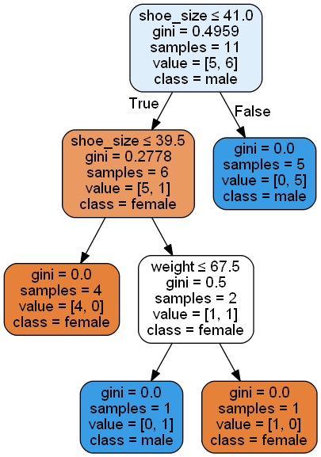

# decision-tree-classifier-scikit

Python project for
* (i) [Decision Tree Classifier](#decision-tree-clf) using open source scikit-learn library ([examples](#decision-tree-clf-examples))

## Dependencies

The .py project adopts [scikit-learn](http://scikit-learn.org/) - an open source Python library that implements a range of machine learning, preprocessing, cross-validation and visualization algorithms - and [PyDotPlus](pydotplus.readthedocs.io/) - a Python Interface to Graphviz's Dot language.

To install the `scikit-learn` dependency from [Python Package Index](https://pypi.python.org/pypi/pip) (PIP), execute the command in the prompt ```python pip install -U scikit-learn```.

To install the `PyDotPlus` dependency from [Python Package Index](https://pypi.python.org/pypi/pip) (PIP), execute the command in the prompt ```python pip install -U graphviz``` and ```python install -U pydotplus```.

> The [Graphviz](http://www.graphviz.org/) package must also be installed to use some dependent features, such as export PDF and/or PNG based on generated decision tree graph.

> Other dependencies as ```argparse``` and ```csv``` are native to Python platform.

## Contact / License

Feel free to contact me by mail: guilherme.farto@gmail.com

---

<a name="decision-tree-clf"></a>
## Decision Tree Classifier Scikit (decision_tree_clf_scikit.py)
> Based on scikit-learn

Usage:
```python
python decision_tree_clf_scikit.py [-h] [-p PATH] [-c CSV] [-cl CLASSES] [-d DELIMITER] [-q QUOTE] [-e] [-o OUTPUTFILENAME]
```

The arguments shoud be:

`-p PATH, --path PATH` *(optional)*
* path of the directory that contains the data and files

`-c CSV, --csv CSV` *(optional)*
* path of csv file that contains all training data
    
`-cl CLASSES, --classes CLASSES` *(optional)*
* name of csv file (only with classes) that contains all training data. Using this argument implies that the csv file (`-c CSV, --csv CSV` argument) should not contain the (last) column with classes

`-d DELIMITER, --delimiter DELIMITER` *(optional)*
* delimiter char for CSV file

`-q QUOTE, --quote QUOTE` *(optional)*
* quote char for CSV file

`-e, --export` *(optional)*
* generate and export PDF and PNG with decision tree graph

`-o OUTPUTFILENAME, --outputFileName OUTPUTFILENAME` *(optional)*
* output file name for PDF and PNG files

<a name="all-examples"></a>
## Examples

<a name="decision-tree-clf-examples"></a>
### > Examples for predicting genre (male or female) by decision tree classifier

**Basic usage:**

* **Example #1: Train and predict using default "data.csv" CSV file**

```python
python decision_tree_clf_scikit.py
```

Output:

```python
	Opening CSV file: [data.csv]
	Identifiers ...: ['height', 'weight', 'shoe_size', 'gender']
	Values ........: [['181', '80', '44'], ['177', '70', '43'], ['160', '60', '38'], ['154', '54', '37'], ['166', '65', '40'], ['190', '90', '47'], ['175', '64', '39'], ['177', '70', '40'], ['159', '55', '37'], ['171', '75', '42'], ['181', '85', '43']]
	Classes .......: ['male', 'male', 'female', 'female', 'male', 'male', 'female', 'female', 'female', 'male', 'male']
	Prediction for [[190, 70, 43]] =  ['male']
	Prediction for [[177, 55, 35]] =  ['female']
	Prediction for [[190, 70, 43], [177, 55, 35]] =  ['male' 'female']
```

* **Example #2: Train and predict using default "data.csv" CSV file but also generating/exporting PDF and PNG files (`-e, --export` argument)**

```python
python decision_tree_clf_scikit.py -e
```

> This [section](#exporting-graphical-representation-decision-tree-graph) exemplifies the feature for generating and exporting Decision Tree graph.

Output:

The same output as previous item but generating and export PDF and PNG files based on the Decision Tree graph.

**Another examples:**

* **Example #3: Train and predict using default "data.csv" CSV file from a custom directory**

```python
python decision_tree_clf_scikit.py -p c:/data-science
```

* **Example #4: Train and predict using default "data.csv" CSV file from a custom directory but also generating/exporting PDF and PNG files**

```python
python decision_tree_clf_scikit.py -e -p c:/data-science
```

* **Example #5: Train and predict using customs CSV files for data values (`-c CSV, --csv CSV` argument) and data classes (`-cl CLASSES, --classes CLASSES` argument)**

```python
python decision_tree_clf_scikit.py -c data_without_classes.csv -cl classes.csv
```

* **Example #6: Train and predict using a custom CSV file with delimiter `";"` (`-d DELIMITER, --delimiter DELIMITER` argument) - instead of `","`**

```python
python decision_tree_clf_scikit.py -c custom-data1.csv -d ;
```

* **Example #7: Train and predict using a custom CSV file with delimiter `";"` and quote char `"'"` (`-q QUOTE, --quote QUOTE` argument)**

```python
python decision_tree_clf_scikit.py -c custom-data2.csv -d ; -q '
```

* **Example #8: Train and predict using a custom CSV file with delimiter `";"` and quote char `"'"` but also generating/exporting PDF and PNG files**

```python
python decision_tree_clf_scikit.py -c custom-data2.csv -d ; -q ' -e
```

* **Example #9: Train and predict using a custom CSV file with delimiter `";"` and quote char `"'"` but also generating/exporting PDF and PNG files with custom name (`-o OUTPUTFILENAME, --outputFileName OUTPUTFILENAME` argument)**

```python
python decision_tree_clf_scikit.py -c custom-data2.csv -d ; -q ' -e -o myfile
```

> The exported files will be named as `myfile.pdf` and `myfile.png`.

<a name="additional-information"></a>
## Additional information

<a name="extracting-data-csv-files"></a>
### > Extracting data from CSV files

The Python function ```openCsvFiles()``` is responsible for opening and extracting data from CSV files. This function will return three (3) essential informations: `identifiers`, `values`, and `classes`.

* **`identifiers`**: a list that represents the identifiers (column headings - first line) of the CSV files;

> For example, `height`, `weight`, `shoe_size`, and `gender` in the context of characteristics and genre (male or female)

* **`values`**: a list that represents the values for training data (all rows excluding the identifiers - previous item) of the CSV files;

> For example, the following data:

```
181,80,44
177,70,43
160,60,38
154,54,37
166,65,40
190,90,47
175,64,39
177,70,40
159,55,37
171,75,42
181,85,43
```

* **`classes`**: a list that represents the classes (or results) according to identifiers and values of the CSV files;

> For example, the following data (each row is related to the values - previous item):

```
male
male
female
female
male
male
female
female
female
male
male
```

The following `snippet` represents the extraction of data from CSV files:

```python
	identifiers, values, classes = openCsvFiles(CSV_FILE, CLASSES_CSV_FILE)

	print "Identifiers ...: %s" % (identifiers)
	print "Values ........: %s" % (values)
	print "Classes .......: %s" % (classes)
```

<a name="exporting-graphical-representation-decision-tree-graph"></a>
### > Exporting graphical representation for Decision Tree graph (PDF and PNG files)

As mentioned, the `-e, --export` argument can be used to generate and export PDF and PNG files based on the Decision Tree graph.

> In addition, it's possible to change the default file name by using the `-o OUTPUTFILENAME, --outputFileName OUTPUTFILENAME` argument.
> The default file names are `data_graph.pdf` and `data_graph.png`.

A sample [PDF](example-output-files/data_graph.pdf) and [PNG](example-output-files/data_graph.png) can be visualized using these links.

| data_graph.png           |
| ------------------------ |
|  |

<a name="predicting-trained-decision-tree"></a>
### > Predicting by trained Decision Tree

The graph can be used to predict possible outputs to new values after the decision tree training with the original CSV data files.

The .py project is developed to attempt three (3) predictions of examples for new values. For example, the genre (male or female) will be predicted according to the characteristics of `height`, `weight`, and `shoe_size`:

```python
    ## male prediction class
    prediction = clf.predict([[190, 70, 43]])
    print "Prediction for [[190, 70, 43]] = ", prediction

    ## female prediction class
    prediction = clf.predict([[177, 55, 35]])
    print "Prediction for [[177, 55, 35]] = ", prediction

    ## male and female prediction classes
    prediction = clf.predict([[190, 70, 43], [177, 55, 35]])
    print "Prediction for [[190, 70, 43], [177, 55, 35]] = ", prediction
```

Output:

```python
    Prediction for [[190, 70, 43]] =  ['male']
    Prediction for [[177, 55, 35]] =  ['female']
    Prediction for [[190, 70, 43], [177, 55, 35]] =  ['male' 'female']
```
